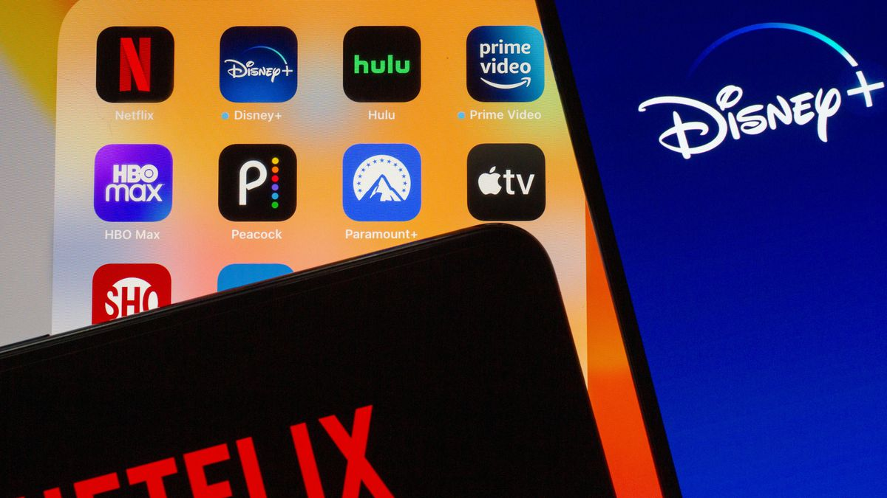

# Native App Compiler

<div align="center"> </img></div>

## Instructions

### Requirements

  * **Python**: `3.7+`
  * **NodeJS**: `12.9+`

### Step 1: Installing your apps
 Follow these instructions in order to use the Native App Compiler
 
 * Download and install Node.JS 12.9 or later from https://nodejs.org
 * Download and install Python 3.7 or later from https://python.org
 
 **Note**: Windows 10 users can use `winget` to install both much quicker.
 
 * Run the following commands in Windows Command Prompt:
 
 ```bat
  > npm install -g nativefier
  > python -m pip install --upgrade castlabs_evs
  > python -m castlabs_evs.account signup
  ```

 * Clone the repo via the following command:

 **Note**: Cloning to any other directory than the one used in this command will cause the Native App Compiler to fail.

 ```bat
 > git clone https://github.com/DevCorner-Github/Nativefier-Apps.git %systemdrive%\Native-Apps
 ```

 * Double click the `app-menu` file and select the app you want to build:

## Links

 * [Native Apps](https://github.com/DevCorner-Github/Nativefier-Apps/wiki/Native-Apps)
